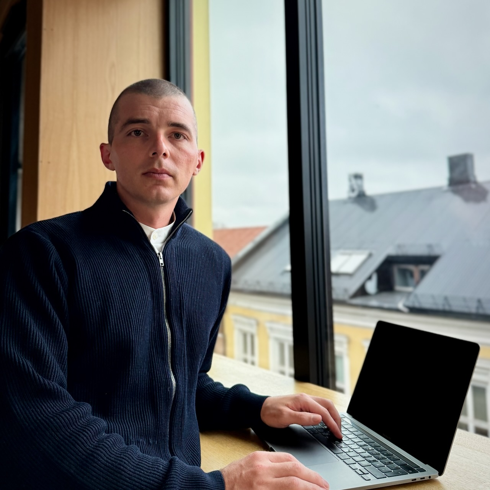

```{r}
#| echo: false
#| warning: false
#| message: false
d <- knitcitations::read.bibtex("publications.bib")
source("_pubs.R")
n_pub <- length(d)
prof <- scholar::get_profile("75oKEWoAAAAJ")
citations <- formatC(prof$total_cites, big.mark = ",", format = "f", digits = 0)
h_index <- formatC(prof$h_index, format = "f", digits = 0)
n_cran <- 12
```

```{=html}
<div class="page">
<div class="mast"><div>
<p class="kick">Applied Statistician · Researcher</p>
<h1 class="name">Richard Aubrey White</h1>
<p class="sub">Ph.D. in Biostatistics, Harvard University</p>
</div></div>
<p class="lead">Richard leads the Norwegian Syndromic Surveillance System (<a href="https://www.github.com/norsyss">NorSySS</a>) at the Norwegian Institute of Public Health, developing real-time systems to monitor population health and detect outbreaks across Norway's five million residents.</p>
<p class="bodyp">His work focuses on syndromic surveillance, signal-detection algorithms, and the design of real-time reporting systems for public-health operations. Combining statistical modeling with operational epidemiology, he builds the infrastructure that supports health authorities nationwide.</p>
<p class="bodyp">From 2015 to 2022 he was statistical lead for the Norwegian Mortality Monitoring System (NorMOMO), running weekly all-cause mortality analyses for Norway and <a href="https://github.com/EuroMOMOnetwork/MOMO/blob/dbb3632827e037fb469223fec3fa2aa079d5d0b6/DESCRIPTION#L6">contributing</a> to the European monitoring system for total mortality (<a href="https://www.euromomo.eu">EuroMOMO</a>).</p>
<div class="stats">
<div><div class="statN"><a href="publications.html">`r n_pub`</a></div><div class="statL">Publications</div></div>
<div><div class="statN"><a href="https://scholar.google.com/citations?user=75oKEWoAAAAJ&hl=en&oi=ao">`r citations`</a></div><div class="statL">Citations</div></div>
<div><div class="statN"><a href="https://scholar.google.com/citations?user=75oKEWoAAAAJ&hl=en&oi=ao">`r h_index`</a></div><div class="statL">h-index</div></div>
<div><div class="statN"><a href="#rpackages">`r n_cran`</a></div><div class="statL">R packages on CRAN</div></div>
</div>

<h2 class="H">Selected Experience</h2>
<div class="xpGrid">
<a class="xpCard" target="_self" href="#exp-norsyss"><p class="xpRole">Researcher / Project Manager</p><p class="xpOrg">Norwegian Institute of Public Health</p><p class="xpMeta">2023–NOW · OSLO, NORWAY</p><p class="xpDesc">Leads Norway's national syndromic surveillance; sets statistical methodology and alerts health authorities to outbreaks in real time.</p></a>
<a class="xpCard" target="_self" href="#exp-srilanka"><p class="xpRole">Health Officer</p><p class="xpOrg">Norwegian Red Cross (IFRC)</p><p class="xpMeta">2022 · COLOMBO, SRI LANKA</p><p class="xpDesc">Head statistician for a 3,100-household nationwide needs assessment during the country's humanitarian emergency.</p></a>
<a class="xpCard" target="_self" href="#exp-mozambique"><p class="xpRole">Community-Based Surveillance Delegate</p><p class="xpOrg">Norwegian Red Cross (IFRC)</p><p class="xpMeta">2019 · BEIRA, MOZAMBIQUE</p><p class="xpDesc">Responded to the cholera outbreak after Cyclone Idai; ran a real-time surveillance system across Red Cross oral-rehydration points.</p></a>
<a class="xpCard" target="_self" href="#exp-palestine"><p class="xpRole">Statistician</p><p class="xpOrg">Palestinian National Institute of Public Health</p><p class="xpMeta">2017–2019 · RAMALLAH, PALESTINE</p><p class="xpDesc">Trained local staff in data management and statistical programming for the national maternal- and child-health registry.</p></a>
<a class="xpCard" target="_self" href="#exp-ebola"><p class="xpRole">GIS Expert / Data Manager</p><p class="xpOrg">World Health Organization</p><p class="xpMeta">2015 · KAMBIA, SIERRA LEONE</p><p class="xpDesc">Responded to the Ebola epidemic — built and ran a real-time surveillance system linking treatment centers, care centers and burials.</p></a>
<a class="xpCard" target="_self" href="#exp-gbd"><p class="xpRole">Biostatistician</p><p class="xpOrg">World Health Organization</p><p class="xpMeta">2011 · GENEVA, SWITZERLAND</p><p class="xpDesc">Produced Global Burden of Disease (GBD 2010) prevalence estimates — vision loss, micronutrient deficiency and stunting — across all UN member states.</p></a>
</div>

<h2 class="H">Flagship Projects</h2>
<div class="projGrid">
<div><p class="pName">NorSySS</p><p class="pMeta">Project Manager · 2023–now</p><p class="pDesc"><a href="https://www.github.com/norsyss">Norway's national syndromic surveillance system</a> — 100+ syndromes from GP and out-of-hours consultations, with 1,000,000+ automated analyses daily across every municipality.</p></div>
<div><p class="pName">Core Surveillance 9 (cs9)</p><p class="pMeta">Lead Developer · 2014–now</p><p class="pDesc"><a href="https://niphr.github.io/cs9">Open-source R framework</a> for building real-time surveillance systems — scheduled analysis, automated reporting and alerting, reproducible by design. The backbone of NorSySS and Sykdomspulsen.</p></div>
<div><p class="pName">Sykdomspulsen</p><p class="pMeta">Technical Lead · 2019–2023</p><p class="pDesc"><a href="post/2021-11-18-poster-prize-for-sykdomspulsen/">Award-winning</a> national platform built with an 8-person team; 1,000+ daily reports spanning mortality (<a href="https://euromomo.eu">EuroMOMO</a>), COVID-19 and 80+ infectious-disease syndromes.</p></div>
</div>
<div class="pkgwrap" id="rpackages"><p class="pkglab">R packages — CRAN</p><div class="pkgs"><a class="pkg" href="https://www.csids.no/attrib/">attrib</a><a class="pkg" href="https://www.rwhite.no/cohort/">cohort</a><a class="pkg" href="https://www.csids.no/csalert/">csalert</a><a class="pkg" href="https://www.csids.no/csdata/">csdata</a><a class="pkg" href="https://www.csids.no/csdb/">csdb</a><a class="pkg" href="https://www.csids.no/csmaps/">csmaps</a><a class="pkg" href="https://www.csids.no/csstyle/">csstyle</a><a class="pkg" href="https://www.csids.no/cstidy/">cstidy</a><a class="pkg" href="https://www.csids.no/cstime/">cstime</a><a class="pkg" href="https://www.csids.no/csutil/">csutil</a><a class="pkg" href="https://www.rwhite.no/org/">org</a><a class="pkg" href="https://www.rwhite.no/plnr/">plnr</a></div></div>
<div class="pkgwrap"><p class="pkglab">R packages — GitHub</p><div class="pkgs"><a class="pkg" href="https://niphr.github.io/cs9">cs9</a><a class="pkg" href="https://github.com/EuroMOMOnetwork/MOMO/">MOMO</a></div></div>

<h2 class="H">Key Publications</h2>
```

```{r}
#| echo: false
#| warning: false
#| results: asis
pub_cards(d, keys = c("white2026mortalitya", "White2026consultations", "White2024"))
```

```{=html}
<a class="morelink" href="publications.html">View all `r n_pub` publications →</a>

<h2 class="H">Education</h2>
<div class="grid2">
<div>
<p class="edu"><span class="school">Harvard University</span><br><a href="articles/2012-white.pdf">Ph.D.</a> in Biostatistics <i>· 2011–2012</i><br>M.A. in Biostatistics <i>· 2009–2011, Frank Knox Fellowship</i></p>
<p class="edu"><span class="school">University of Wollongong</span><br>B. Adv. Mathematics <i>· 2005–2009, First Class Honours</i></p>
</div>
<div>
<p class="edu"><span class="school">University of Bergen</span><br>Nordic languages &amp; literature <i>· 2022–2023, one-year program</i></p>
</div>
</div>

<h2 class="H">Technical Skills &amp; Languages</h2>
<div class="grid2">
<div class="skill"><b>Programming &amp; Analysis</b>R (20+ yrs) · STATA (15+ yrs) · Python<b>Infrastructure &amp; DevOps</b>Docker (10+ yrs) · CI/CD (10+ yrs) · Kubernetes</div>
<div class="skill"><b>Languages</b>English (Fluent) · Norwegian (B2)</div>
</div>

<h2 class="H">Professional Experience</h2>
<h3 class="org">Norwegian Institute of Public Health</h3>
<div class="row" id="exp-norsyss"><div class="meta">02.2023 – now<br><span class="metaLoc">Oslo, Norway</span></div><div><p class="role">Researcher / Project Manager — NorSySS</p><ul class="ul"><li>Project manager for <a href="https://www.github.com/norsyss/">NorSySS</a>, surveilling infectious diseases from general-practitioner and out-of-hours primary-care consultations.</li><li>Complex statistical analyses run automatically for every location in Norway, producing reports and alerting stakeholders.</li><li>Organized the 2023 Northern European Symposium on Automated Surveillance.</li></ul><p class="stack">R · Kubernetes · Docker/Podman · CI/CD · Apache Airflow · <a href="https://niphr.github.io/cs9">cs9</a></p></div></div>
<div class="row"><div class="meta">07.2019 – 01.2023<br><span class="metaLoc">Oslo, Norway</span></div><div><p class="role">Researcher / Technical Lead — Sykdomspulsen</p><ul class="ul"><li>Technical lead for the <a href="post/2021-11-18-poster-prize-for-sykdomspulsen/">award-winning</a> Sykdomspulsen platform (8-person team), a real-time analysis and surveillance system.</li><li>Owned training, mentoring, supervision and quality assurance of statistical methods and code.</li><li>Surveillance areas: all-cause / cause-specific / attributable mortality (part of <a href="https://euromomo.eu">EuroMOMO</a>), COVID-19, influenza, tuberculosis, IPD, meningococcal disease, pertussis, antibiotic use, and 80+ syndromes via NorSySS.</li><li>1,000,000+ analyses per day; 1,000+ automatic reports per day (PDF / Excel / email / SMS).</li></ul><p class="stack">R · Kubernetes · Docker/Podman · CI/CD · Apache Airflow · <a href="https://niphr.github.io/cs9">cs9</a></p></div></div>
<div class="row"><div class="meta">06.2014 – 06.2019<br><span class="metaLoc">Oslo, Norway</span></div><div><p class="role">Researcher — Infectious Disease Epidemiology</p><ul class="ul"><li>Advised outbreak teams and researchers in statistical concepts, methods and programming.</li><li>Statistical supervision of five <a href="https://www.ecdc.europa.eu/en/epiet-euphem">EPIET</a> fellows and nine Ph.D. students.</li><li><a href="articles/2015-white-ebola.pdf">Modeled</a> the 2014 Ebola outbreak's likelihood of reaching Norway and the effectiveness of entry screening; <a href="articles/2017-meijerink.pdf">modeled</a> HCV burden in Norwegian people who inject drugs.</li><li>Head statistician for the PEEP (Haydom, Tanzania) and Safer Births Moyo (Muhimbili, Tanzania) randomized trials.</li></ul></div></div>
<div class="row"><div class="meta">01.2012 – 05.2014<br><span class="metaLoc">Oslo, Norway</span></div><div><p class="role">Postdoctoral Researcher — Genes &amp; Environment</p><ul class="ul"><li>Built database structures integrating questionnaires, lab toxicant concentrations and Illumina microbial data into analysis datasets.</li><li><a href="articles/2015-white-suicide.pdf">Investigated</a> the relationship between seasonality, sunlight and suicide; and between <a href="articles/2013-miller.pdf">gun ownership and completed suicide</a> in the US.</li></ul></div></div>

<h3 class="org">Consortium for Statistics in Disease Surveillance (CSIDS)</h3>
<div class="row"><div class="meta">01.2023 – 12.2025<br><span class="metaLoc">Oslo, Norway</span></div><div><p class="role">Chairperson</p><ul class="ul"><li>Oversaw the collaboration between statisticians, epidemiologists and researchers developing the open-source <a href="https://www.github.com/niphr">R packages</a> used for disease surveillance.</li></ul></div></div>

<h3 class="org">Norwegian Red Cross</h3>
<div class="row"><div class="meta">04.2024 – 05.2024<br><span class="metaLoc">Remote</span></div><div><p class="role">Head Statistician (IFRC)</p><ul class="ul"><li>Head statistician for an 1,800-household nationwide needs assessment responding to the complex humanitarian emergency in Sri Lanka; developed the protocol and analyzed most of the data.</li></ul></div></div>
<div class="row" id="exp-srilanka"><div class="meta">08.2022 – 09.2022<br><span class="metaLoc">Colombo, Sri Lanka</span></div><div><p class="role">Health Officer (IFRC)</p><ul class="ul"><li>Head statistician for a 3,100-household nationwide <a href="articles/2022-wickremesekera.pdf">needs assessment</a> (<a href="articles/2022-wickremesekera-annex.pdf">annex</a>) during Sri Lanka's humanitarian emergency; developed the protocol and health-sector questions and analyzed most of the data.</li></ul></div></div>
<div class="row" id="exp-mozambique"><div class="meta">04.2019 – 05.2019<br><span class="metaLoc">Beira, Mozambique</span></div><div><p class="role">Community-Based Surveillance Delegate (IFRC)</p><ul class="ul"><li>Responded to the cholera outbreak caused by Cyclone Idai; ran a <a href="resources/mozambique.webm">real-time surveillance system</a> for people with diarrhea visiting Red Cross oral-rehydration points and liaised with the Ministry of Health.</li></ul></div></div>

<h3 class="org">Norwegian Scientific Committee for Food and Environment (VKM)</h3>
<div class="row"><div class="meta">01.2026 – now<br><span class="metaLoc">Oslo, Norway</span></div><div><p class="role">External Expert — Next-Generation Risk Assessment</p><ul class="ul"><li>Implementing the statistical protocol to evaluate INVITES-IN, a tool for assessing the internal validity of in-vitro studies.</li></ul></div></div>
<div class="row"><div class="meta">2023<br><span class="metaLoc">Oslo, Norway</span></div><div><p class="role">External Expert — Next-Generation Risk Assessment</p><ul class="ul"><li>Developed the <a href="articles/2023-mathisen.pdf">statistical protocol</a> to evaluate INVITES-IN, a tool for assessing the internal validity of in-vitro studies.</li></ul></div></div>

<h3 class="org">Palestinian National Institute of Public Health (PNIPH)</h3>
<div class="row" id="exp-palestine"><div class="meta">09.2017 – 09.2019<br><span class="metaLoc">Ramallah, Palestine</span></div><div><p class="role">Statistician</p><ul class="ul"><li>Trained local staff in data management and statistical programming for the national maternal- and child-health <a href="articles/2021-isbeih.pdf">registry</a> over a two-year posting.</li><li>Validated indicators from the newly formed national healthcare-worker registry.</li></ul></div></div>

<h3 class="org">World Health Organization (WHO)</h3>
<div class="row" id="exp-ebola"><div class="meta">01.2015 – 02.2015<br><span class="metaLoc">Kambia, Sierra Leone</span></div><div><p class="role">GIS Expert / Data Manager — GOARN</p><ul class="ul"><li>Responded to the West-African Ebola epidemic; built and ran a real-time surveillance system linking the national emergency number, holding centers, community care centers, treatment centers and burials.</li><li>Geocoded and mapped outbreak data; produced daily situation reports; trained and supervised national and international staff.</li></ul></div></div>
<div class="row" id="exp-gbd"><div class="meta">04.2011 – 11.2011<br><span class="metaLoc">Geneva, Switzerland</span></div><div><p class="role">Biostatistician — Mortality &amp; Burden of Disease</p><ul class="ul"><li>Collected <a href="articles/2015-mathers.pdf">cause-of-death</a> data from national registries and calculated avoidable-mortality estimates across high-income and developing countries.</li><li>Produced Global Burden of Disease (GBD 2010) prevalence estimates — <a href="articles/2013-stevens.pdf">vision loss</a>, <a href="articles/2015-stevens.pdf">micronutrient deficiency</a> and <a href="articles/2012-stevens.pdf">stunting</a> — for all UN member states.</li></ul></div></div>
<div class="row"><div class="meta">06.2010 – 11.2010<br><span class="metaLoc">Remote</span></div><div><p class="role">Biostatistician — Stop TB Department</p><ul class="ul"><li>Managed, cleaned and analyzed MDR-TB datasets from South Africa, Uzbekistan, Bangladesh and Peru.</li><li>Provided <a href="articles/2016-mitnick.pdf">recommendations</a> for the WHO Guidelines for the Programmatic Management of Drug-Resistant Tuberculosis (3rd ed.) via multi-cohort survival analyses.</li></ul></div></div>

<div class="foot"><span class="mail"><a href="mailto:hello@rwhite.no">hello@rwhite.no</a></span><div class="links"><a href="https://github.com/raubreywhite">GitHub</a><a href="https://x.com/raubreywhite">X</a><a href="https://no.linkedin.com/in/richard-white4">LinkedIn</a></div></div>
</div>
<script>
document.addEventListener('click', function (e) {
  var a = e.target.closest('a[href^="#"]');
  if (!a) return;
  var id = a.getAttribute('href');
  if (id.length < 2) return;
  var el = document.querySelector(id);
  if (!el) return;
  e.preventDefault();
  el.scrollIntoView({ behavior: 'smooth', block: 'start' });
  history.replaceState(null, '', id);
});
</script>
```
